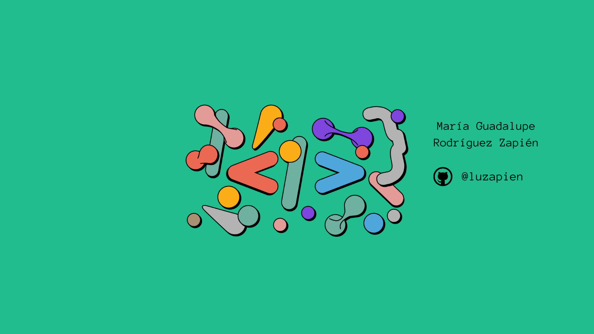

    

<h1 align="center">Hi 👋, I'm María Rodríguez Zapién</h1>
<h3 align="center">A passionate frontend developer from México</h3>

- 🔭 I’m currently working as Jr Developer

- 🌱 I’m currently improving my skills in **Typescript and Node.Js** and learning about **REACT**

- 📫 How to reach me **lu.rzapien.92@gmail.com**

- 📄 Know about my experiences [https://drive.google.com/file/d/1u4X5ak2oHUq-tKzpnTiSDBaK59hloVjk/view?usp=share_link](https://drive.google.com/file/d/1u4X5ak2oHUq-tKzpnTiSDBaK59hloVjk/view?usp=share_link)

<h3 align="left">Connect with me:</h3>

<h3 align="left">Languages and Tools:</h3>

             

